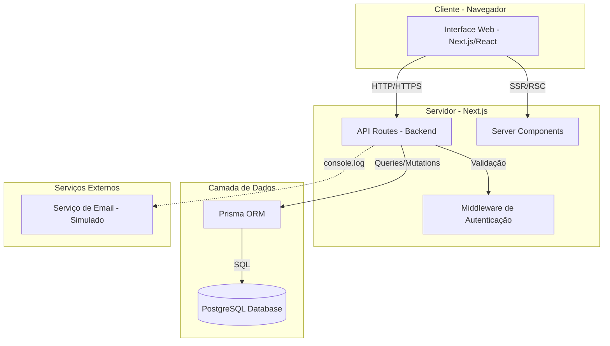
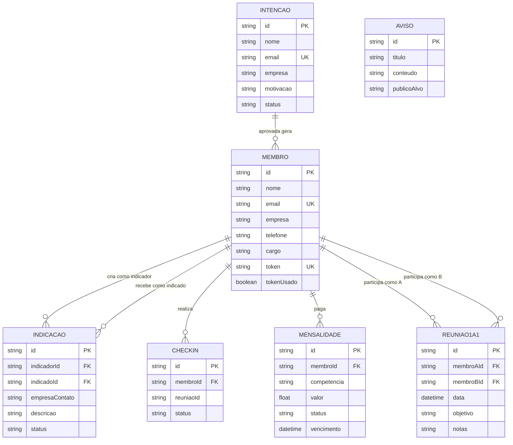

# Arquitetura da Plataforma de Gestão para Grupos de Networking

**Autor**: Luiz Felipe Apolinário

## Sumário

1. [Visão Geral](#visão-geral)
2. [Objetivos do Sistema](#objetivos-do-sistema)
3. [Diagrama da Arquitetura](#diagrama-da-arquitetura)
4. [Modelo de Dados](#modelo-de-dados)
5. [Estrutura de Componentes (Frontend)](#estrutura-de-componentes-frontend)
6. [Definição da API (Endpoints)](#definição-da-api-endpoints)
7. [Segurança](#segurança)
8. [Módulos Futuros (Planejamento de Alto Nível)](#módulos-futuros-planejamento-de-alto-nível)

## Visão Geral

Este documento apresenta a arquitetura completa da **Plataforma de Gestão para Grupos de Networking**, um sistema fullstack desenvolvido para digitalizar e otimizar a gestão de membros e suas interações em grupos de networking focados em geração de negócios.

A solução foi projetada para substituir planilhas e controles manuais por um sistema centralizado, eficiente e escalável, permitindo aos administradores gerenciar o fluxo de admissão de novos membros e aos membros ativos realizarem indicações de negócios entre si.

## Objetivos do Sistema

O sistema foi desenvolvido para atender aos seguintes objetivos principais:

1. **Automatizar o fluxo de admissão de membros**: desde a manifestação de interesse até o cadastro completo, passando pela aprovação administrativa.
2. **Facilitar a geração de negócios**: permitindo que membros criem indicações de oportunidades para outros membros e acompanhem o status dessas indicações.
3. **Centralizar informações**: substituindo controles manuais por um sistema integrado com banco de dados relacional, garantindo consistência e rastreabilidade.
4. **Garantir segurança e controle de acesso**: implementando proteção de rotas administrativas e validação de tokens para cadastros.

## Diagrama da Arquitetura

## Modelo de Dados

### Diagrama de Entidades e Relacionamentos (Implementado + Planejado)

### Descrição das Entidades Implementadas

**Entidade: Intencao**
Representa a manifestação de interesse de uma pessoa em participar do grupo.

**Entidade: Membro**
Representa um membro ativo do grupo, aprovado após submeter uma intenção.

**Entidade: Indicacao**
Representa uma indicação de negócio feita por um membro para outro.

## Estrutura de Componentes (Frontend)

A estrutura de pastas do frontend segue as convenções do Next.js 14 com App Router, organizando componentes de forma modular e reutilizável.

## Definição da API (Endpoints)

### Endpoints Implementados

- `POST /api/intencoes` (Público): Cria uma nova intenção.
- `GET /api/intencoes` (Admin): Lista todas as intenções.
- `PATCH /api/intencoes/:id` (Admin): Aprova ou recusa uma intenção.
- `GET /api/membros/:token` (Público): Valida um token de cadastro.
- `POST /api/membros` (Público): Completa o cadastro de um membro usando o token.
- `GET /api/membros` (Admin): Lista todos os membros ativos.
- `POST /api/indicacoes` (Membro): Cria uma nova indicação.
- `GET /api/indicacoes` (Membro): Lista indicações feitas ou recebidas.
- `PATCH /api/indicacoes/:id` (Membro): Atualiza o status de uma indicação.

## Segurança

- **Proteção de Rotas Administrativas**: As rotas de API designadas como `(Admin)` são protegidas por uma chave secreta (`ADMIN_KEY`) enviada através do header `X-Admin-Key`. A chave é gerenciada via variáveis de ambiente, garantindo que apenas usuários autorizados possam realizar operações administrativas.
- **Validação de Tokens**: O fluxo de cadastro é protegido por tokens únicos e de uso único, garantindo que apenas usuários convidados possam completar o registro.
- **Validação de Dados (Input Validation)**: Todas as entradas de API são rigorosamente validadas no backend utilizando Zod para prevenir ataques como SQL Injection e XSS.

## Módulos Futuros (Planejamento de Alto Nível)

Esta seção descreve funcionalidades que foram planejadas na arquitetura para evolução futura do sistema, mas que não foram implementadas no escopo atual.

### 1. Comunicação e Engajamento

- **Avisos/Comunicados**: Funcionalidade para administradores enviarem comunicados para todos os membros ou segmentos específicos.
  - **Entidade**: `Aviso {id, titulo, conteudo, publicoAlvo(enum: TODOS|MEMBROS), publicadoEm}`
  - **Endpoints**: 
    - `POST /api/avisos` (Admin): Cria um novo aviso.
    - `GET /api/avisos?audiencia=MEMBROS` (Membro): Lista avisos para membros.

- **Check-in de Presença**: Sistema para membros registrarem presença em reuniões.
  - **Entidade**: `Checkin {id, membroId, reuniaoId, status(enum: PRESENTE|FALTOU), timestamp}`
  - **Endpoints**:
    - `POST /api/checkins` (Membro): Realiza o check-in em uma reunião.
    - `GET /api/checkins?reuniaoId=...` (Admin): Lista presenças de uma reunião.

### 2. Acompanhamento e Performance

- **Reuniões 1:1**: Ferramenta para agendar e registrar notas de reuniões individuais entre membros.
  - **Entidade**: `Reuniao1a1 {id, membroAId, membroBId, data, objetivo, notas}`
  - **Endpoints**:
    - `POST /api/1a1` (Membro): Agenda uma nova reunião 1:1.
    - `GET /api/1a1?membroId=...` (Membro): Lista reuniões 1:1 de um membro.

- **Dashboards e Relatórios**: Painéis para visualizar a performance do grupo.
  - **Visão**: KPIs como membros ativos, indicações por mês, negócios fechados, etc.
  - **Estratégia**: Implementação via endpoints agregadores (`GET /api/metrics?periodo=mensal`) que utilizam consultas Prisma (`groupBy`, `_count`) para gerar as métricas.

### 3. Financeiro

- **Gestão de Mensalidades**: Sistema para administradores gerarem e membros pagarem mensalidades.
  - **Entidade**: `Mensalidade {id, membroId, competencia(YYYY-MM), valor, status(enum: PENDENTE|PAGO|ATRASADO), vencimento}`
  - **Endpoints**:
    - `POST /api/mensalidades` (Admin): Gera mensalidades para um período.
    - `PATCH /api/mensalidades/:id` (Admin/Webhook): Atualiza o status de pagamento.
    - `GET /api/mensalidades?membroId=...` (Membro): Lista mensalidades de um membro.
