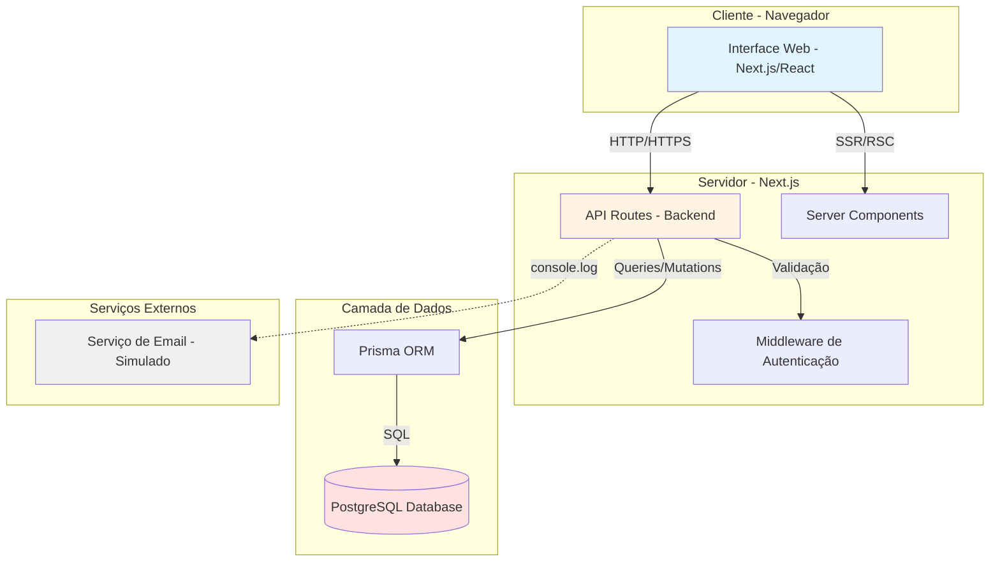
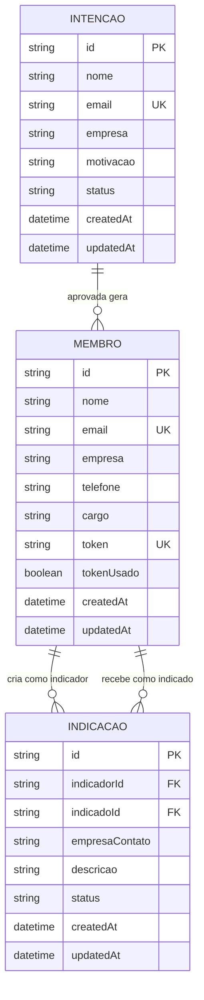

# Arquitetura da Plataforma de Gestão para Grupos de Networking

## Visão Geral

Este documento apresenta a arquitetura completa da **Plataforma de Gestão para Grupos de Networking**, um sistema fullstack desenvolvido para digitalizar e otimizar a gestão de membros e suas interações em grupos de networking focados em geração de negócios.

A solução foi projetada para substituir planilhas e controles manuais por um sistema centralizado, eficiente e escalável, permitindo aos administradores gerenciar o fluxo de admissão de novos membros e aos membros ativos realizarem indicações de negócios entre si.

## Objetivos do Sistema

O sistema foi desenvolvido para atender aos seguintes objetivos principais:

1. **Automatizar o fluxo de admissão de membros**: desde a manifestação de interesse até o cadastro completo, passando pela aprovação administrativa.

2. **Facilitar a geração de negócios**: permitindo que membros criem indicações de oportunidades para outros membros, acompanhem o status dessas indicações e registrem agradecimentos por negócios concretizados.

3. **Centralizar informações**: substituindo controles manuais por um sistema integrado com banco de dados relacional, garantindo consistência e rastreabilidade.

4. **Garantir segurança e controle de acesso**: implementando proteção de rotas administrativas e validação de tokens para cadastros.

## Diagrama da Arquitetura



### Componentes Principais

#### 1. Frontend (Next.js 14 + React 18 + TypeScript)

O frontend é construído utilizando o **Next.js 14** com **App Router**, aproveitando os recursos modernos de **Server Components** e **Client Components** para otimizar o desempenho e a experiência do usuário. A aplicação é totalmente tipada com **TypeScript** e estilizada com **Tailwind CSS**.

**Principais características:**

- **Renderização híbrida**: combinação de Server-Side Rendering (SSR) e Client-Side Rendering (CSR) conforme necessário
- **Componentização modular**: componentes reutilizáveis organizados em pastas lógicas (ui, forms, layouts)
- **Validação de formulários**: utilizando **React Hook Form** e **Zod** para validação robusta
- **Estado local e global**: gerenciamento de estado com React Hooks e Context API
- **Responsividade**: design mobile-first com Tailwind CSS

#### 2. Backend (Next.js API Routes)

O backend é implementado utilizando as **API Routes** do Next.js, aproveitando a integração nativa entre frontend e backend no mesmo projeto. Isso simplifica o desenvolvimento, deployment e manutenção.

**Principais características:**

- **RESTful API**: endpoints organizados seguindo convenções REST
- **Validação de dados**: schemas Zod para validação de entrada
- **Tratamento de erros**: respostas padronizadas com códigos HTTP apropriados
- **Segurança**: proteção de rotas administrativas com variáveis de ambiente
- **Geração de tokens**: tokens únicos para convites de cadastro

#### 3. Banco de Dados (PostgreSQL + Prisma ORM)

O banco de dados utilizado é o **PostgreSQL**, um sistema de gerenciamento de banco de dados relacional robusto e escalável. A comunicação com o banco é feita através do **Prisma ORM**, que oferece type-safety, migrations automáticas e uma excelente developer experience.

**Principais características:**

- **Schema tipado**: modelos Prisma totalmente tipados
- **Migrations versionadas**: controle de versão do schema do banco
- **Queries otimizadas**: Prisma Client com queries eficientes
- **Relacionamentos**: suporte completo a relações entre entidades

## Modelo de Dados

### Diagrama de Entidades e Relacionamentos



### Descrição das Entidades

#### Entidade: Intencao

Representa a manifestação de interesse de uma pessoa em participar do grupo de networking.

| Campo | Tipo | Descrição | Constraints |
|-------|------|-----------|-------------|
| id | String | Identificador único (CUID) | Primary Key |
| nome | String | Nome completo do interessado | Required |
| email | String | Email do interessado | Required, Unique |
| empresa | String | Nome da empresa | Required |
| motivacao | String | Motivação para participar | Required |
| status | String | Status da intenção | Default: "PENDENTE", Enum: PENDENTE, APROVADO, RECUSADO |
| createdAt | DateTime | Data de criação | Auto-generated |
| updatedAt | DateTime | Data de atualização | Auto-updated |

**Regras de negócio:**
- Uma intenção com status "APROVADO" deve gerar automaticamente um registro de Membro com token único
- O email deve ser único no sistema para evitar duplicações
- A motivação deve ter no mínimo 20 caracteres

#### Entidade: Membro

Representa um membro ativo do grupo de networking, que foi aprovado após submeter uma intenção.

| Campo | Tipo | Descrição | Constraints |
|-------|------|-----------|-------------|
| id | String | Identificador único (CUID) | Primary Key |
| nome | String | Nome completo do membro | Required |
| email | String | Email do membro | Required, Unique |
| empresa | String | Nome da empresa | Required |
| telefone | String | Telefone de contato | Optional |
| cargo | String | Cargo na empresa | Optional |
| token | String | Token único para cadastro | Required, Unique |
| tokenUsado | Boolean | Indica se o token já foi utilizado | Default: false |
| createdAt | DateTime | Data de criação | Auto-generated |
| updatedAt | DateTime | Data de atualização | Auto-updated |

**Relacionamentos:**
- Um membro pode criar múltiplas indicações (relação "IndicadorMembro")
- Um membro pode receber múltiplas indicações (relação "IndicadoMembro")

**Regras de negócio:**
- O token deve ser gerado automaticamente ao aprovar uma intenção
- O token só pode ser usado uma vez para completar o cadastro
- Após o uso do token, o campo tokenUsado deve ser marcado como true

#### Entidade: Indicacao

Representa uma indicação de negócio feita por um membro para outro membro do grupo.

| Campo | Tipo | Descrição | Constraints |
|-------|------|-----------|-------------|
| id | String | Identificador único (CUID) | Primary Key |
| indicadorId | String | ID do membro que fez a indicação | Foreign Key → Membro |
| indicadoId | String | ID do membro que recebeu a indicação | Foreign Key → Membro |
| empresaContato | String | Nome da empresa/contato indicado | Required |
| descricao | String | Descrição da oportunidade | Required |
| status | String | Status da indicação | Default: "NOVA", Enum: NOVA, EM_CONTATO, FECHADA, RECUSADA |
| createdAt | DateTime | Data de criação | Auto-generated |
| updatedAt | DateTime | Data de atualização | Auto-updated |

**Relacionamentos:**
- Cada indicação pertence a um membro indicador (many-to-one)
- Cada indicação pertence a um membro indicado (many-to-one)

**Regras de negócio:**
- Um membro não pode criar uma indicação para si mesmo (indicadorId ≠ indicadoId)
- O status pode ser atualizado pelo membro indicado
- A descrição deve ter no mínimo 20 caracteres

### Justificativa da Escolha do Banco de Dados

A escolha do **PostgreSQL** como banco de dados relacional se justifica pelos seguintes motivos:

1. **Integridade referencial**: o sistema possui relacionamentos claros entre entidades (Intencao → Membro, Membro → Indicacao), que são melhor representados em um banco relacional com foreign keys e constraints.

2. **ACID compliance**: garantia de transações atômicas, consistentes, isoladas e duráveis, essencial para operações críticas como aprovação de intenções e criação de membros.

3. **Queries complexas**: suporte nativo a JOINs, agregações e subconsultas, facilitando relatórios e dashboards futuros.

4. **Escalabilidade**: PostgreSQL é conhecido por sua capacidade de escalar verticalmente e horizontalmente, suportando o crescimento do sistema.

5. **Ecossistema maduro**: excelente integração com Prisma ORM, ferramentas de backup, monitoramento e migração.

6. **Type-safety com Prisma**: o Prisma gera tipos TypeScript automaticamente a partir do schema, garantindo type-safety em toda a aplicação.

## Estrutura de Componentes (Frontend)

### Organização de Pastas

A estrutura de pastas do frontend segue as convenções do Next.js 14 com App Router, organizando componentes de forma modular e reutilizável:

```
app/
├── (public)/                    # Rotas públicas (sem autenticação)
│   └── intencao/
│       └── page.tsx            # Página de manifestação de interesse
├── (admin)/                     # Rotas administrativas (protegidas)
│   └── admin/
│       ├── intencoes/
│       │   └── page.tsx        # Listagem e gestão de intenções
│       └── layout.tsx          # Layout com proteção administrativa
├── (member)/                    # Rotas de membros (protegidas por token)
│   ├── cadastro/
│   │   └── [token]/
│   │       └── page.tsx        # Cadastro completo com token
│   └── indicacoes/
│       ├── page.tsx            # Listagem de indicações
│       └── nova/
│           └── page.tsx        # Criação de nova indicação
└── api/                         # API Routes (backend)
    ├── intencoes/
    │   ├── route.ts            # POST, GET /api/intencoes
    │   └── [id]/
    │       └── route.ts        # PATCH /api/intencoes/:id
    ├── membros/
    │   ├── route.ts            # POST, GET /api/membros
    │   └── [token]/
    │       └── route.ts        # GET /api/membros/:token
    └── indicacoes/
        ├── route.ts            # POST, GET /api/indicacoes
        └── [id]/
            └── route.ts        # PATCH /api/indicacoes/:id

components/
├── ui/                          # Componentes UI reutilizáveis
│   ├── button.tsx
│   ├── input.tsx
│   ├── card.tsx
│   ├── badge.tsx
│   ├── dialog.tsx
│   ├── form.tsx
│   ├── label.tsx
│   ├── select.tsx
│   ├── textarea.tsx
│   └── toast.tsx
├── forms/                       # Componentes de formulários específicos
│   ├── IntencaoForm.tsx        # Formulário de intenção
│   ├── CadastroCompletoForm.tsx # Formulário de cadastro completo
│   └── IndicacaoForm.tsx       # Formulário de indicação
└── layouts/                     # Componentes de layout
    ├── Header.tsx
    ├── Footer.tsx
    └── AdminNav.tsx

lib/
├── db/                          # Configuração do banco de dados
│   └── prisma.ts               # Cliente Prisma singleton
├── validations/                 # Schemas de validação Zod
│   ├── intencao.ts
│   ├── membro.ts
│   └── indicacao.ts
└── utils/                       # Utilitários gerais
    ├── token.ts                # Geração e validação de tokens
    └── api-response.ts         # Helpers para respostas da API

prisma/
├── schema.prisma               # Schema do banco de dados
└── migrations/                 # Migrations do Prisma
```

### Componentes Principais

#### Componentes UI (components/ui/)

Componentes reutilizáveis de interface baseados em padrões de design consistentes:

- **Button**: botão com variantes (primary, secondary, outline, ghost) e tamanhos (sm, md, lg)
- **Input**: campo de entrada com suporte a validação e mensagens de erro
- **Card**: container para agrupar conteúdo relacionado
- **Badge**: indicador visual para status (pendente, aprovado, recusado, nova, fechada)
- **Dialog**: modal para confirmações e ações críticas
- **Form**: wrapper para formulários com integração React Hook Form
- **Label**: rótulo acessível para campos de formulário
- **Select**: dropdown para seleção de opções
- **Textarea**: campo de texto multilinha
- **Toast**: notificações temporárias para feedback ao usuário

#### Componentes de Formulários (components/forms/)

Componentes especializados para formulários específicos do domínio:

- **IntencaoForm**: formulário de manifestação de interesse (público)
  - Campos: nome, email, empresa, motivação
  - Validação com Zod
  - Feedback de sucesso/erro

- **CadastroCompletoForm**: formulário de cadastro completo (protegido por token)
  - Campos: nome, email, empresa, telefone, cargo
  - Validação de token
  - Feedback de conclusão

- **IndicacaoForm**: formulário de criação de indicação (membros)
  - Campos: membro indicado, empresa/contato, descrição
  - Seleção de membros do grupo
  - Validação e feedback

#### Componentes de Layout (components/layouts/)

Componentes estruturais para organização das páginas:

- **Header**: cabeçalho com navegação principal
- **Footer**: rodapé com informações institucionais
- **AdminNav**: navegação específica para área administrativa

### Padrões de Componentização

O projeto segue os seguintes padrões de componentização:

1. **Separação de responsabilidades**: componentes UI são genéricos e reutilizáveis, enquanto componentes de domínio (forms, layouts) são específicos do negócio.

2. **Composição sobre herança**: componentes complexos são compostos por componentes menores e mais simples.

3. **Props tipadas**: todas as props são tipadas com TypeScript para garantir type-safety.

4. **Client vs Server Components**: uso estratégico de Server Components para melhor performance e Client Components quando necessário (interatividade, hooks).

5. **Acessibilidade**: todos os componentes seguem as diretrizes WCAG 2.1 com suporte a navegação por teclado e leitores de tela.

## Definição da API

A API segue os princípios **REST** (Representational State Transfer), utilizando métodos HTTP semânticos e estruturas de dados JSON.

### Endpoints Principais

#### 1. Gestão de Intenções

##### POST /api/intencoes

Cria uma nova intenção de participação.

**Request:**
```json
{
  "nome": "João Silva",
  "email": "joao.silva@empresa.com",
  "empresa": "Empresa XYZ Ltda",
  "motivacao": "Desejo participar do grupo para expandir minha rede de contatos e gerar novas oportunidades de negócio na área de tecnologia."
}
```

**Response (201 Created):**
```json
{
  "success": true,
  "data": {
    "id": "clx1234567890abcdef",
    "nome": "João Silva",
    "email": "joao.silva@empresa.com",
    "empresa": "Empresa XYZ Ltda",
    "motivacao": "Desejo participar do grupo para expandir minha rede de contatos...",
    "status": "PENDENTE",
    "createdAt": "2025-11-04T10:30:00.000Z",
    "updatedAt": "2025-11-04T10:30:00.000Z"
  },
  "message": "Intenção de participação registrada com sucesso!"
}
```

**Validações:**
- nome: mínimo 3 caracteres
- email: formato válido e único no sistema
- empresa: mínimo 2 caracteres
- motivacao: mínimo 20 caracteres

**Erros possíveis:**
- 400 Bad Request: dados inválidos
- 409 Conflict: email já cadastrado

##### GET /api/intencoes

Lista todas as intenções (rota protegida - admin).

**Headers:**
```
X-Admin-Key: valor_da_variavel_de_ambiente
```

**Query Parameters:**
- status: (opcional) filtra por status (PENDENTE, APROVADO, RECUSADO)
- page: (opcional) número da página (default: 1)
- limit: (opcional) itens por página (default: 10)

**Response (200 OK):**
```json
{
  "success": true,
  "data": [
    {
      "id": "clx1234567890abcdef",
      "nome": "João Silva",
      "email": "joao.silva@empresa.com",
      "empresa": "Empresa XYZ Ltda",
      "motivacao": "Desejo participar do grupo...",
      "status": "PENDENTE",
      "createdAt": "2025-11-04T10:30:00.000Z",
      "updatedAt": "2025-11-04T10:30:00.000Z"
    }
  ],
  "pagination": {
    "page": 1,
    "limit": 10,
    "total": 25,
    "totalPages": 3
  }
}
```

**Erros possíveis:**
- 401 Unauthorized: chave administrativa inválida

##### PATCH /api/intencoes/:id

Atualiza o status de uma intenção (aprovar/recusar) - rota protegida.

**Headers:**
```
X-Admin-Key: valor_da_variavel_de_ambiente
```

**Request:**
```json
{
  "status": "APROVADO"
}
```

**Response (200 OK):**
```json
{
  "success": true,
  "data": {
    "intencao": {
      "id": "clx1234567890abcdef",
      "status": "APROVADO",
      "updatedAt": "2025-11-04T11:00:00.000Z"
    },
    "membro": {
      "id": "clx9876543210fedcba",
      "nome": "João Silva",
      "email": "joao.silva@empresa.com",
      "token": "abc123def456ghi789",
      "tokenUsado": false
    },
    "conviteLink": "http://localhost:3000/cadastro/abc123def456ghi789"
  },
  "message": "Intenção aprovada! Convite gerado com sucesso."
}
```

**Lógica de negócio:**
- Ao aprovar (status = "APROVADO"), o sistema cria automaticamente um registro de Membro com token único
- O token é gerado usando UUID v4
- Um link de convite é retornado (simulação de envio de email)

**Erros possíveis:**
- 401 Unauthorized: chave administrativa inválida
- 404 Not Found: intenção não encontrada
- 400 Bad Request: status inválido

#### 2. Gestão de Membros

##### GET /api/membros/:token

Valida um token e retorna informações básicas do membro (para página de cadastro).

**Response (200 OK):**
```json
{
  "success": true,
  "data": {
    "id": "clx9876543210fedcba",
    "nome": "João Silva",
    "email": "joao.silva@empresa.com",
    "empresa": "Empresa XYZ Ltda",
    "tokenUsado": false
  }
}
```

**Erros possíveis:**
- 404 Not Found: token inválido ou não encontrado
- 400 Bad Request: token já foi utilizado

##### POST /api/membros

Completa o cadastro de um membro usando o token.

**Request:**
```json
{
  "token": "abc123def456ghi789",
  "telefone": "(11) 98765-4321",
  "cargo": "Diretor Comercial"
}
```

**Response (200 OK):**
```json
{
  "success": true,
  "data": {
    "id": "clx9876543210fedcba",
    "nome": "João Silva",
    "email": "joao.silva@empresa.com",
    "empresa": "Empresa XYZ Ltda",
    "telefone": "(11) 98765-4321",
    "cargo": "Diretor Comercial",
    "tokenUsado": true,
    "createdAt": "2025-11-04T11:00:00.000Z",
    "updatedAt": "2025-11-04T11:15:00.000Z"
  },
  "message": "Cadastro completado com sucesso! Bem-vindo ao grupo."
}
```

**Validações:**
- token: obrigatório e válido
- telefone: opcional, formato válido
- cargo: opcional, mínimo 3 caracteres

**Erros possíveis:**
- 404 Not Found: token inválido
- 400 Bad Request: token já utilizado ou dados inválidos

##### GET /api/membros

Lista todos os membros ativos (rota protegida - admin).

**Headers:**
```
X-Admin-Key: valor_da_variavel_de_ambiente
```

**Response (200 OK):**
```json
{
  "success": true,
  "data": [
    {
      "id": "clx9876543210fedcba",
      "nome": "João Silva",
      "email": "joao.silva@empresa.com",
      "empresa": "Empresa XYZ Ltda",
      "cargo": "Diretor Comercial",
      "createdAt": "2025-11-04T11:00:00.000Z"
    }
  ]
}
```

#### 3. Sistema de Indicações

##### POST /api/indicacoes

Cria uma nova indicação de negócio.

**Request:**
```json
{
  "indicadorId": "clx9876543210fedcba",
  "indicadoId": "clx1111222233334444",
  "empresaContato": "Empresa ABC S.A.",
  "descricao": "Oportunidade de fornecimento de software para gestão empresarial. Contato direto com o diretor de TI."
}
```

**Response (201 Created):**
```json
{
  "success": true,
  "data": {
    "id": "clx5555666677778888",
    "indicadorId": "clx9876543210fedcba",
    "indicadoId": "clx1111222233334444",
    "empresaContato": "Empresa ABC S.A.",
    "descricao": "Oportunidade de fornecimento de software...",
    "status": "NOVA",
    "createdAt": "2025-11-04T12:00:00.000Z",
    "updatedAt": "2025-11-04T12:00:00.000Z",
    "indicador": {
      "nome": "João Silva",
      "empresa": "Empresa XYZ Ltda"
    },
    "indicado": {
      "nome": "Maria Santos",
      "empresa": "Tech Solutions"
    }
  },
  "message": "Indicação criada com sucesso!"
}
```

**Validações:**
- indicadorId: obrigatório, deve existir
- indicadoId: obrigatório, deve existir, diferente de indicadorId
- empresaContato: obrigatório, mínimo 2 caracteres
- descricao: obrigatório, mínimo 20 caracteres

**Erros possíveis:**
- 400 Bad Request: dados inválidos ou auto-indicação
- 404 Not Found: membro não encontrado

##### GET /api/indicacoes

Lista indicações (feitas ou recebidas por um membro).

**Query Parameters:**
- membroId: ID do membro (obrigatório)
- tipo: "feitas" ou "recebidas" (obrigatório)
- status: (opcional) filtra por status

**Response (200 OK):**
```json
{
  "success": true,
  "data": [
    {
      "id": "clx5555666677778888",
      "empresaContato": "Empresa ABC S.A.",
      "descricao": "Oportunidade de fornecimento de software...",
      "status": "NOVA",
      "createdAt": "2025-11-04T12:00:00.000Z",
      "indicador": {
        "nome": "João Silva",
        "empresa": "Empresa XYZ Ltda"
      },
      "indicado": {
        "nome": "Maria Santos",
        "empresa": "Tech Solutions"
      }
    }
  ]
}
```

##### PATCH /api/indicacoes/:id

Atualiza o status de uma indicação.

**Request:**
```json
{
  "status": "EM_CONTATO"
}
```

**Response (200 OK):**
```json
{
  "success": true,
  "data": {
    "id": "clx5555666677778888",
    "status": "EM_CONTATO",
    "updatedAt": "2025-11-04T13:00:00.000Z"
  },
  "message": "Status da indicação atualizado com sucesso!"
}
```

**Validações:**
- status: deve ser um dos valores válidos (NOVA, EM_CONTATO, FECHADA, RECUSADA)

**Erros possíveis:**
- 404 Not Found: indicação não encontrada
- 400 Bad Request: status inválido

### Padrões de Resposta da API

Todas as respostas da API seguem um padrão consistente:

**Sucesso:**
```json
{
  "success": true,
  "data": { /* dados retornados */ },
  "message": "Mensagem descritiva (opcional)"
}
```

**Erro:**
```json
{
  "success": false,
  "error": {
    "code": "VALIDATION_ERROR",
    "message": "Descrição do erro",
    "details": { /* detalhes adicionais (opcional) */ }
  }
}
```

### Códigos de Status HTTP

| Código | Significado | Uso |
|--------|-------------|-----|
| 200 | OK | Requisição bem-sucedida (GET, PATCH) |
| 201 | Created | Recurso criado com sucesso (POST) |
| 400 | Bad Request | Dados inválidos ou erro de validação |
| 401 | Unauthorized | Autenticação necessária ou inválida |
| 404 | Not Found | Recurso não encontrado |
| 409 | Conflict | Conflito (ex: email duplicado) |
| 500 | Internal Server Error | Erro interno do servidor |

## Segurança

### Proteção de Rotas Administrativas

As rotas administrativas são protegidas por uma chave de acesso armazenada em variável de ambiente:

```typescript
// Middleware de autenticação administrativa
function validateAdminKey(request: Request): boolean {
  const adminKey = request.headers.get('X-Admin-Key');
  return adminKey === process.env.ADMIN_KEY;
}
```

**Configuração:**
```env
ADMIN_KEY=sua_chave_secreta_aqui
```

### Validação de Tokens

Os tokens de cadastro são validados para garantir que:
1. O token existe no banco de dados
2. O token ainda não foi utilizado
3. O token pertence a um membro válido

### Validação de Dados

Todos os dados de entrada são validados usando **Zod schemas** antes de serem processados:

```typescript
// Exemplo: validação de intenção
const intencaoSchema = z.object({
  nome: z.string().min(3, "Nome deve ter no mínimo 3 caracteres"),
  email: z.string().email("Email inválido"),
  empresa: z.string().min(2, "Empresa deve ter no mínimo 2 caracteres"),
  motivacao: z.string().min(20, "Motivação deve ter no mínimo 20 caracteres")
});
```

### Prevenção de Ataques

- **SQL Injection**: prevenido pelo uso do Prisma ORM com queries parametrizadas
- **XSS**: prevenido pela sanitização automática do React e validação de entrada
- **CSRF**: mitigado pelo uso de tokens e validação de origem
- **Rate Limiting**: pode ser implementado futuramente com middleware

## Escalabilidade

A arquitetura foi projetada para ser escalável, permitindo crescimento futuro:

### Escalabilidade Horizontal

- **Frontend**: pode ser deployado em múltiplas instâncias com load balancer
- **Backend**: API Routes stateless permitem múltiplas instâncias
- **Banco de dados**: PostgreSQL suporta replicação read-only para leitura

### Otimizações Futuras

1. **Cache**: implementação de Redis para cache de queries frequentes
2. **CDN**: distribuição de assets estáticos via CDN
3. **Background Jobs**: processamento assíncrono com filas (Bull/BullMQ)
4. **Monitoramento**: integração com ferramentas de APM (Application Performance Monitoring)
5. **Logging**: centralização de logs com ELK Stack ou similar

## Tecnologias Utilizadas

### Frontend
- **Next.js 14**: framework React com App Router
- **React 18**: biblioteca para interfaces de usuário
- **TypeScript**: superset do JavaScript com tipagem estática
- **Tailwind CSS**: framework CSS utility-first
- **React Hook Form**: gerenciamento de formulários
- **Zod**: validação de schemas
- **Lucide React**: biblioteca de ícones

### Backend
- **Next.js API Routes**: backend integrado ao Next.js
- **Prisma**: ORM moderno para Node.js e TypeScript
- **Zod**: validação de dados de entrada

### Banco de Dados
- **PostgreSQL**: banco de dados relacional
- **Prisma Client**: cliente tipado para acesso ao banco

### Testes
- **Jest**: framework de testes
- **React Testing Library**: testes de componentes React
- **Supertest**: testes de API

### Ferramentas de Desenvolvimento
- **ESLint**: linter para JavaScript/TypeScript
- **Prettier**: formatador de código
- **Husky**: git hooks para qualidade de código
- **GitHub Actions**: CI/CD automatizado

## Conclusão

Esta arquitetura foi projetada para ser **robusta**, **escalável** e **manutenível**, seguindo as melhores práticas de desenvolvimento fullstack moderno. A separação clara de responsabilidades, a tipagem forte com TypeScript, a validação rigorosa de dados e a estrutura modular garantem que o sistema possa evoluir de forma sustentável.

A escolha de tecnologias modernas e amplamente adotadas (Next.js, React, PostgreSQL, Prisma) garante um ecossistema rico de ferramentas, documentação e suporte da comunidade, facilitando a manutenção e evolução futura do sistema.
